## Host configuration
Ansible-based provisioning of host system (Ubuntu). Key features:
- zfs and networking
- backup
- system monitoring
- firewall
- email for system notifications
- kubernetes and docker


## Services
Docker-based services:
- plex
- transmission
- calibre
- databases
- jupyter

Kubernetes (k3s) services:
- Pod security policies and general hardening
- Traefik ingress with Let's Encrypt
- Forward auth to protect private sites
- nginx (static website)
- custom-built panel for local docker services




## Execution
```
ansible-playbook playbook.yml  -i hosts --extra-vars "ansible_sudo_pass="$HOMELAB_ROOT_PASS
```

## TODO
- protect docker.sock
- local docker registry
- unattended upgrades
- telegraf smartctl
- docker remote api certs
- automate removal of failed zpool devices
- automatically add endpoint to portainer during provisioning

## Manual Steps
1. Configure backup from laptop to homeserver
2. Update No-IP to include sub hosts, done on a local router
3. Prepare environment variables